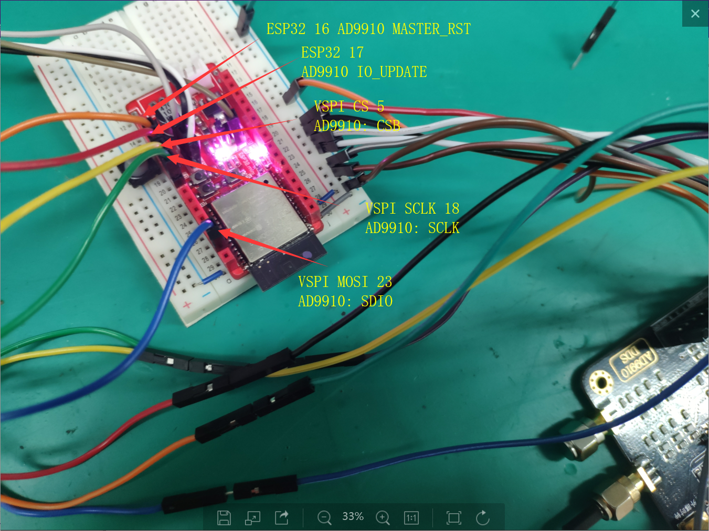

# AD9910 Document

## 简介
* 该文件用于驱动AD9910
    * (DDS 1GHz sample rate)
    * 提供四种模式 ( 仅实现了 Single Tone)
* 采用Arduino方式完成开发,可移植性强
* 在ESP32上完成测试
* AD9910.h 封装了AD9910类,并提供了一些常用函数
* AD9910.ino 为测试函数

## 使用方法
* 参考Ad9910.ino的用法
* 例化AD9910对象
    > AD9910 DDS(cs, rst,update,sdio,sclk);
* 用到了SPI,需在setup()中初始化SPI以及ADS9910
    ```
    SPI.begin()
    DDS.begin()
    ```
* 调用AD9910的set_Amp, set_freq函数设置DDS输出
    * !注意两个函数的输入参数均为double型,直接输入100.0则为float型,可能会出现问题
    * freq的输入单位为Hz
    * Amp的输入单位为mV(Vpp),注意输出范围在Vpp 500mV左右就饱和了
* 引脚定义: (针对ESP32)


    | Name        | Description      | Pin  |
    |---------------|:-------------:|------:|
    | CS (CSB)   | ESP32 VSPI's SS | 5 |
    | SCLK      | ESP32 VSPI's SCLK |   18 |
    | SDIO | ESP32 VSPI's MOSI    |    23 |
    | RST | AD9910's MASTER_RESET|  16|
    |UPDATE| AD9910's IO_UPDATE| 17|
    |PWR| AD9910's EXT_PWR_DOWN  (一定要拉低,不然不工作| LOW|
    |DRC/DRHOLD/DROVER| AD9910对应引脚(没有用到DR模式,拉低)| LOW|
    |PS0/PS1/PS2|AD9910的Profile选择,三位PS选择8个Profile,都拉低选Profile0|LOW|
    |OSK|禁用OSK|LOW

## 函数简介
* AD9910::begin()  
    *  *进行AD9910的所有初始化*
    * 首先进行pinMode设置并且给引脚赋初值
    * 调用 reset
    * 调用 initialize
* AD9910::reset()
    * *进行AD9910的复位*
    * 将RST脚拉低,delay 1ms,然后拉高
* AD9910::update()
    * *对AD9910进行IO_UPDATE*(AD9910对寄存器写值之后需要进行IO Update才会生效)
* AD9910::SPI_Write_Reg(uint8_t addr, uint8_t bytes[], uint8_t num_bytes)
    * *写寄存器函数*
    * 输入参数为寄存器的地址, 输入数据(byte数组), 和输入byte数目
    * 调用SPI.beginTransact开始SPI传输
    * 手动拉低CS,先写地址,再写入字节,再把CS拉高,并endTransaction
* AD9910::initialize()
    * *逐个写入3个控制字cfr1,2,3,分别写入地址0x00,0x01,0x02*
    * 最后Update
* AD9910::set_freq(double freq, uint8_t profile = 0)
    * *改变freq函数*
    * 先改变profile的值,再将整个profile写入
* AD9910::set_Amp(double amp, uint8_t profile = 0)
    * *改变Amp的函数*
## Tips
* 整个流程最难的地方就是写控制字...由于支持的功能比较多,所以很容易错,下面会单独开一个Section讲这个问题...
* 有大佬说这个SPI的时序比较奇怪,但是我这边貌似用SPI的默认MODE0就能运行
* RST和PWR_DOWN引脚必须拉低,不然没现象(弱智的模块把这个脚引出来,但是啥都没说)
* 模块上有一个决定时钟源的跳线帽,给到远离SMA头的那个地方是内部时钟输入
* SysCLK由板上晶振倍频而来(Datasheet推荐25M晶振,但是实际上是个40M的,会反应在CFR3的配置上)
* :cry:(可能只有我一个人卡在这里) 这玩意功耗有点高,给我电源限流了,给个500mA限流吧

## 控制字
```
uint8_t cfr1[4] = {0x00, 0x40, 0x00, 0x02};
uint8_t cfr2[4] = {0x01, 0x00, 0x08, 0x20};
uint8_t cfr3[4] = {0x05, 0x08, 0x41, 0x32};
uint8_t DAC_config[4] = {0x00,0x00,0x00,0xFF};
uint8_t profile0[8] = {0x3F, 0x3F, 0x00, 0x00, 0x25, 0x09, 0x7b, 0x42};
```
* 采用Single Tone模式基本都可以按照Default,有几个点需要注意
* 控制字都是从高位到低位, 写寄存器的时候也是先写高位(到高地址),以下方括号里面是bit数
* cfr1[22] Inverse Sinc Filter 默认关上, 但是这里打开
* cfr1[2] 决定是两线还是三线输出,SDO是否有输出(如果是两线AD9910的SDIO做SPI的信号线)
* cfr2[24] Enable Amplitude Scale要打开才能改变幅度
* cfr3[24:26]: 默认虽然是111(Bypass VCO),但是手册中写如果要主频1GHz的话,就需要为101(5)
* cfr[19:21] Icp,DataSheet中默认为111,实测001也可
* cfr[8] PLL_Enable需要设置成1
* cfr[7:1] 是比例系数,即为SysCLK(需要1GHz)/RefCLK(40MHZ晶振) 倍数为25(11001)
    * 所以低8位为00110010 0x32

## 接线
* 
* 

##
* 感谢@CNLHC对本弱智在调试过程中的帮助
